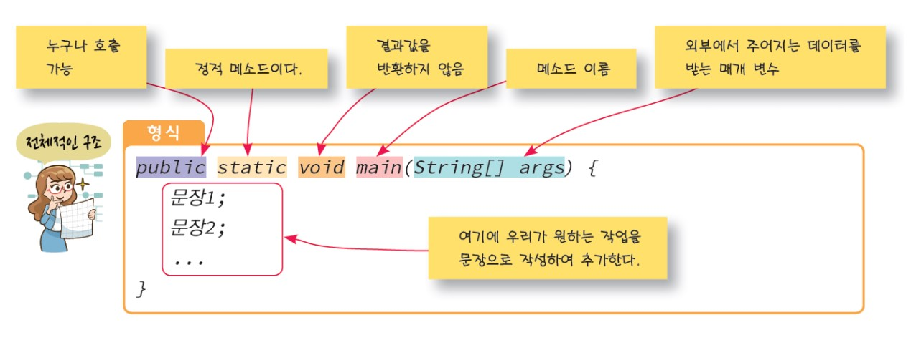

# 1. Class
## class
- 객체 지향 언어의 기본적인 빌딩 블록
- public class: 이 클래스는 누구든지 사용 가능

## 소스 파일과 클래스 이름
- 소스 안에 public class가 있다면 -> 반드시 소스 파일의 이름 == public class 이름
- 하나의 소스 파일 안에 public class가 2개 이상 있으면 컴파일 오류 발생

## 인스턴스
- 어떠한 클래스로부터 만들어진 객체

# 2. Method
## method
- 특정한 작업을 수행하는 코드의 묶음
- 외부로부터 입력 받아 특정한 작업 수행하고, 결과를 반환하는 블랙 박스
- 클래스 안에 정의됨.

## main() method
- main() method가 포함된 class가 반드시 하나는 있어야 함.
- main() method에서 자바 프로그램의 실행이 시작됨.

# 3. 자료형
(1) 기초형: 실제 값 저장
- 정수형: byte, short, int, long
- 실수형: float, double
- 논리형: boolean
- 문자형: char

(2) 참조형: 실제 객체를 가리키는 주소 저장 -> class, interface, 배열 등을 가리킴

# 4. 변수
(1) 변수 이름
- 변수 이름은 식별자(identifier)의 일종
- 식별자는 유니코드 문자와 숫자의 조합(한글 가능)
- 식별자의 첫 문자는 일반적으로 유니코드 문자
- 두 번째 문자부터는 문자, 숫자, _, $ 등이 가능
- '_'으로도 시작 가능
- 숫자로 시작하면 안됨
- '#'로 시작하면 안됨
- '$'로 시작할 수 있음

(2) 식별자 이름 관례
- 클래스: 각 단어의 첫 글자는 대문자로 ex: StaffMember(CamelCase)
- 변수명, 메소드명: 첫번째 단어는 소문자로 시작, 2번째 단어부터는 대문자로 시작 ex: acctNumber
- 상수: 모든 글자를 대문자로: MAX_NUMBER

# 5. 상수
- 상수는 한번 값이 정해지면 변경 불가
- 앞에 final을 붙이면 됨

# 6. 형변환
(1) 자동 형변환
- 피연산자 중 하나가 double/float/long 형이면 다른 피연산자도 double/float/long형으로 변환된다.
- 그렇지 않으면 모든 피연산자는 int형으로 변환된다.

(2) 강제 형변환: `(새로운 자료형) 수식;`
 
 
 
 

Reference:
- [강원대 수업 자료](https://cs.kangwon.ac.kr/~swson/18Fall_JP2/lecture_notes/l-02-%EC%9E%90%EB%B0%94%ED%94%84%EB%A1%9C%EA%B7%B8%EB%9E%98%EB%B0%8D_%EA%B8%B0%EC%B4%88.pdf)
- [JAVA 기초 문법 개념 정리](https://velog.io/@rlafbf222/JAVA-%EA%B8%B0%EC%B4%88-%EB%AC%B8%EB%B2%95-%EA%B0%9C%EB%85%90-%EC%A0%95%EB%A6%AC)